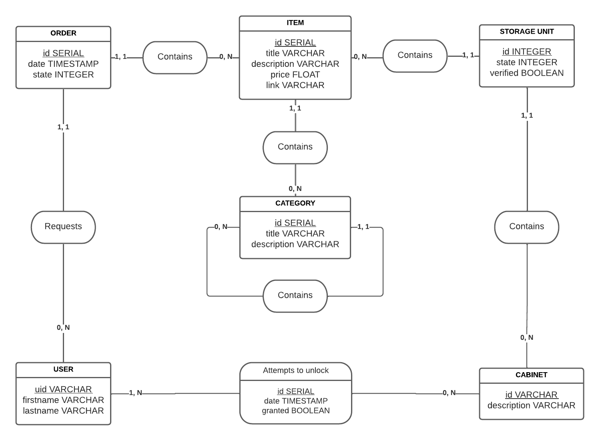

# SMART-INVENTORY-DB-API

This repository contains the source code for the database (PostgreSQL) and REST API (FastAPI) of the Smart Inventory ecosystem. 
The database is designed to host data for the inventory management, storage management, material order management and cabinet access monitoring features of the platforms of the ecosystem (Smart Lock, Augmented Worker Interface, DVIC's website).

## Table of contents
- [Deployment](#deployment)
- [Entity-Relationship Diagram](#entity-relationship-diagram)
- [Relational Schema](#relational-schema)
- [Testing](#testing)

## Deployment

 1. Download the docker-compose.yml file and edit it for your application :
 ```
 curl -OL https://raw.githubusercontent.com/DeVinci-Innovation-Center/SMART-INVENTORY-DB-API/main/docker-compose.yml
 ```
 2. From the same directory, start the API and DB with :
 ```
 docker-compose up
 ```
## Entity-Relationship Diagram



## Relational Schema

Primary keys are underlined and foreign keys are preceded by a hash sign :

**users** (<ins>uid</ins>, firstname, lastname)

**cabinets** (<ins>id</ins>, description)

**categories** (<ins>id</ins>, title, description, #parent_id)

**items** (<ins>id</ins>, title, description, price, link, #category_id)

**orders_requests** (<ins>id</ins>, date, state, #item_id, #user_id)

**storage_units** (<ins>id</ins>, state, verified, #item_id, #cabinet_id)

**cabinets_unlock_attempts** (<ins>id</ins>, date, granted, #user_id, #cabinet_id)

## Testing

Run the unit tests with:
```
docker exec -it smartinventory_api python3 -m pytest
```
